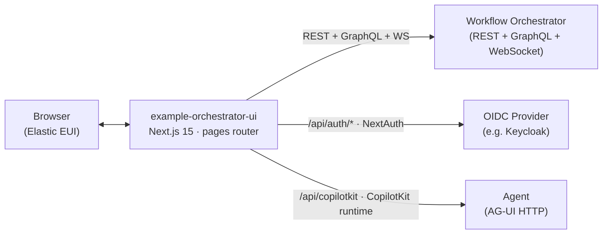

# Example Orchestrator UI

A **minimal reference implementation** of a [Next.js](https://nextjs.org)
front-end for the [Workflow Orchestrator](https://workfloworchestrator.org)
framework. It wraps the published
`@orchestrator-ui/orchestrator-ui-components` library
([Elastic EUI](https://eui.elastic.co/) based) and adds a small set of
example pages that demonstrate how to customize navigation, branding,
translations, and authentication.

Most teams adopt this repo by **making a copy of it** and tailoring it
to their own network/service domain, then pointing it at a Workflow
Orchestrator backend (REST + GraphQL + optional WebSocket).

---

## Table of contents

- [Features](#features)
- [Architecture](#architecture)
- [Prerequisites](#prerequisites)
- [Quick start](#quick-start)
- [Configuration](#configuration)
  - [Backend connection](#backend-connection)
  - [Authentication (OAuth2 / OIDC)](#authentication-oauth2--oidc)
  - [UI feature toggles](#ui-feature-toggles)
  - [Agent (CopilotKit)](#agent-copilotkit)
- [Project layout](#project-layout)
- [Customization](#customization)
  - [Navigation & menu items](#navigation--menu-items)
  - [Branding (logo)](#branding-logo)
  - [Translations](#translations)
  - [Adding pages](#adding-pages)
- [npm scripts](#npm-scripts)
- [Building & deploying](#building--deploying)
- [Local Keycloak for OAuth testing](#local-keycloak-for-oauth-testing)
- [Updating the component library](#updating-the-component-library)
- [Breaking changes](#breaking-changes)
- [Contributing](#contributing)
- [License](#license)

---

## Features

- Minimal reference integration with Workflow Orchestrator, with sensible defaults
- Subscription, workflow, task and metadata management pages
- Built-in pages for **search**, an **example form**, and a CopilotKit
  **agent** chat
- OAuth2 / OIDC login via NextAuth with refresh-token rotation
- Internationalization: `en-GB` (default) and `nl-NL`, both extensible
- Theme toggle (light / dark) and per-environment banners
- Standalone Next.js production output, ready to containerize

## Architecture



The application is intentionally thin: nearly all screens come from
`@orchestrator-ui/orchestrator-ui-components`. This repo wires those
components into a Next.js app and provides the integration glue
(`pages/_app.tsx`, `configuration/`, `translations/`,
`components/AppLogo/`).

## Prerequisites

- **Node.js 18+** (the Docker image uses `node:18-alpine`)
- **npm** (the lockfile is `package-lock.json`)
- A running Workflow Orchestrator backend. The simplest option is the
  [`example-orchestrator`](https://github.com/workfloworchestrator/example-orchestrator)
  reference backend (Docker Compose).

## Quick start

```sh
git clone git@github.com:workfloworchestrator/example-orchestrator-ui.git
cd example-orchestrator-ui

npm install
cp .env.example .env
# edit .env — at minimum, for local dev you typically want:
#   OAUTH2_ACTIVE=false
#   ORCHESTRATOR_API_HOST=http://localhost:8080
#   ORCHESTRATOR_GRAPHQL_HOST=http://localhost:8080

npm run dev    # http://localhost:3000
```

In a separate terminal, start a backend to talk to:

```sh
git clone git@github.com:workfloworchestrator/example-orchestrator.git
cd example-orchestrator
docker compose up
```

You can of course point `ORCHESTRATOR_*` at any other orchestrator
instance.

## Configuration

All runtime configuration is read from environment variables.
`configuration/configuration.ts` maps them into the `OrchestratorConfig`
object that is passed to the component library;
`pages/api/auth/[...nextauth].ts` reads the OAuth/OIDC variables.

A complete starter set lives in `.env.example` — copy it to `.env` (or
`.env.local`) and adjust.

### Backend connection

| Variable                     | Description                                                   |
| ---------------------------- | ------------------------------------------------------------- |
| `ORCHESTRATOR_API_HOST`      | Base URL of the orchestrator REST API (scheme + host + port). |
| `ORCHESTRATOR_API_PATH`      | Path prefix appended to the API host (e.g. `/api`).           |
| `ORCHESTRATOR_GRAPHQL_HOST`  | Base URL of the GraphQL endpoint.                             |
| `ORCHESTRATOR_GRAPHQL_PATH`  | Path of the GraphQL endpoint (e.g. `/api/graphql`).           |
| `ORCHESTRATOR_WEBSOCKET_URL` | WebSocket URL for live updates.                               |
| `USE_WEB_SOCKETS`            | `true` to enable WebSocket-driven updates.                    |

### Authentication (OAuth2 / OIDC)

Authentication is handled by [NextAuth](https://next-auth.js.org/) with
a generic OIDC provider configured from the `wellKnown` URL. PKCE +
state checks are enabled, and access tokens are refreshed automatically.

| Variable                                | Description                                                             |
| --------------------------------------- | ----------------------------------------------------------------------- |
| `OAUTH2_ACTIVE`                         | Set to `false` to disable login entirely (handy for local dev).         |
| `OAUTH2_CLIENT_ID`                      | OAuth2 client ID.                                                       |
| `OAUTH2_CLIENT_SECRET`                  | Optional. Omit for public/PKCE-only clients.                            |
| `OIDC_CONF_FULL_WELL_KNOWN_URL`         | Full URL to the OIDC `.well-known/openid-configuration` document.       |
| `NEXTAUTH_PROVIDER_ID`                  | Internal NextAuth provider id (e.g. `keycloak`).                        |
| `NEXTAUTH_PROVIDER_NAME`                | Human-readable name shown on the sign-in screen.                        |
| `NEXTAUTH_AUTHORIZATION_SCOPE_OVERRIDE` | Optional. Override the requested scopes (default: `openid profile`).    |
| `NEXTAUTH_SECRET`                       | Standard NextAuth secret for signing session tokens (required in prod). |
| `NEXTAUTH_URL`                          | Public base URL of the deployed UI (required by NextAuth in production).|

> **Heads up:** several auth env vars were renamed in commit `edec88c`.
> See [`breaking-changes.md`](./breaking-changes.md) if you're upgrading
> from an older version.

### UI feature toggles

| Variable                         | Description                                                               |
| -------------------------------- | ------------------------------------------------------------------------- |
| `ENVIRONMENT_NAME`               | Label shown in the top bar (e.g. `DEVELOPMENT`, `STAGING`, `PRODUCTION`). |
| `USE_THEME_TOGGLE`               | `true` to show the light/dark theme switcher.                             |
| `SHOW_WORKFLOW_INFORMATION_LINK` | `true` to show a "more info" link on workflow pages.                      |
| `WORKFLOW_INFORMATION_LINK_URL`  | Target URL of that link.                                                  |
| `ENABLE_SUPPORT_MENU_ITEM`       | `true` to add a "Support" menu item.                                      |
| `SUPPORT_MENU_ITEM_URL`          | Target URL for the support menu item.                                     |
| `ENABLE_AO_STACK_STATUS`         | `true` to show the AO-stack status indicator.                             |
| `AO_STACK_STATUS_URL`            | Endpoint that the stack-status widget polls.                              |
| `START_WORKFLOW_FILTERS`         | Pipe-separated list of workflow categories to expose on the start page. Underscores are converted to spaces, e.g. `Create|Modify|Terminate`. |

### Agent (CopilotKit)

The `/agent` page is a [CopilotKit](https://copilotkit.ai/) chat UI bound
to a single agent named `query_agent`. The runtime route at
`pages/api/copilotkit.ts` proxies to an upstream AG-UI HTTP agent,
forwarding the user's OIDC access token as a `Bearer` header.

| Variable    | Description                                                                         |
| ----------- | ----------------------------------------------------------------------------------- |
| `AGENT_URL` | Upstream agent endpoint. Defaults to `http://localhost:8080/api/agent/` if not set. |

If you don't need the agent, simply remove the menu entry from
`pages/_app.tsx` and delete `pages/agent.tsx` +
`pages/api/copilotkit.ts`.

## Project layout

```
.
├── components/AppLogo/        # branding override rendered in the side nav
├── configuration/             # env → OrchestratorConfig mapping
├── pages/                     # Next.js routes (pages router)
│   ├── _app.tsx               # providers, menu, auth wiring
│   ├── index.tsx              # WfoStartPage
│   ├── agent.tsx              # CopilotKit chat page
│   ├── search.tsx
│   ├── settings.tsx
│   ├── subscriptions/         # list + detail
│   ├── workflows/             # list, detail, "new"
│   ├── tasks/                 # list, detail, "new"
│   ├── metadata/              # products, product blocks, resource types, tasks, …
│   └── api/
│       ├── auth/[...nextauth].ts   # NextAuth + OIDC provider
│       └── copilotkit.ts           # CopilotKit runtime → AG-UI agent
├── translations/              # en-GB / nl-NL message catalogs + provider
├── font/                      # Inter web font
├── public/                    # static assets (favicon, etc.)
├── .env.example               # template — copy to .env
├── next.config.js             # i18n + standalone output + transpiled deps
├── Dockerfile                 # multi-stage Next.js standalone build
└── docker-compose.yml         # Keycloak dev instance for OAuth testing
```

Most pages are one-liners that delegate to a component from
`@orchestrator-ui/orchestrator-ui-components`. For example:

```tsx
// pages/search.tsx
import { WfoSearch } from '@orchestrator-ui/orchestrator-ui-components';
export default function SearchPage() {
    return <WfoSearch />;
}
```

This makes it easy to override individual screens by editing one file.

## Customization

### Navigation & menu items

The side navigation is configured in `pages/_app.tsx` via the
`overrideMenuItems` prop on `<WfoPageTemplate>`. The reference
implementation adds three extra entries — `Example form`, `Search`, and
`Agent` — by appending to the default menu items:

```tsx
const addMenuItems = (defaultMenuItems) => [
    ...defaultMenuItems,
    { name: 'Example form', id: '10', href: '/example-form', /* … */ },
    { name: 'Search',       id: '20', href: '/search',       /* … */ },
    { name: 'Agent',        id: '30', href: '/agent',        /* … */ },
];
```

Add, remove, or reorder entries here to shape your own navigation.

### Branding (logo)

`components/AppLogo/AppLogo.tsx` exports `getAppLogo()`, which is passed
to `<WfoPageTemplate getAppLogo={getAppLogo} />`. Replace its contents
(or the neighbouring `styles.ts`) to swap in your own logo / wordmark.
Static assets such as `favicon.png` live in `public/`.

### Translations

`translations/` contains the per-locale JSON catalogs that get **merged**
into the standard messages shipped with the component library. Add or
override keys on a per-key basis; missing keys fall back to the library
defaults.

See [`translations/README.md`](./translations/README.md) for the full
override rules, including how dynamic form-field translations from the
backend `translations/${locale}` endpoint are merged into
`pydanticForms.backendTranslations`.

To add a new locale:

1. Drop a `<locale>.json` next to the existing ones.
2. Add it to the `locales` array in `next.config.js`.
3. Add a matching `case` in `translations/translationsProvider.tsx`.

### Adding pages

Because this is the Next.js **pages router**, you add a new route simply
by creating a file under `pages/`. To make it appear in the nav, add an
entry to `addMenuItems` in `pages/_app.tsx`.

## npm scripts

| Command                | Purpose                                         |
| ---------------------- | ----------------------------------------------- |
| `npm run dev`          | Start the Next.js dev server on port 3000.      |
| `npm run build`        | Production build (emits standalone output).     |
| `npm start`            | Serve the production build.                     |
| `npm run tsc`          | Type-check the project without emitting.       |
| `npm run lint`         | Run ESLint.                                     |
| `npm run prettier`     | Check formatting.                               |
| `npm run prettier-fix` | Apply Prettier formatting.                      |
| `npm test`             | Run Jest (passes with no tests).                |

A Husky `postinstall` hook is registered for pre-commit checks.

## Building & deploying

The included `Dockerfile` produces a small two-stage image:

```sh
docker build -t example-orchestrator-ui .
docker run --rm -p 3000:3000 --env-file .env example-orchestrator-ui
```

Internally it runs `next build` with `output: 'standalone'` (see
`next.config.js`) and copies only the runtime artifacts into the final
image. `node server.js` is the entry point and the container listens on
port `3000`.

For production deployments, remember to set:

- `NEXTAUTH_URL` to the public URL of the UI
- `NEXTAUTH_SECRET` to a strong random value
- the `ORCHESTRATOR_*` variables to your real backend
- `OAUTH2_*` and `OIDC_CONF_FULL_WELL_KNOWN_URL` for your IdP

## Local Keycloak for OAuth testing

`docker-compose.yml` ships a [Keycloak](https://www.keycloak.org/)
container to test the OAuth2 flow locally:

```sh
KEYCLOAK_PORT=8081 \
KEYCLOAK_ADMIN=admin \
KEYCLOAK_ADMIN_PASSWORD=admin \
docker compose up
```

Then create a realm + client in the Keycloak admin UI and point the
`OAUTH2_*` and `OIDC_CONF_FULL_WELL_KNOWN_URL` variables at it.

## Updating the component library

`@orchestrator-ui/orchestrator-ui-components` is declared with version
`*` so the Turborepo monorepo build always resolves the freshest version.
When using this repo **standalone**, you have to refresh the lockfile
manually:

```sh
npm update @orchestrator-ui/orchestrator-ui-components
npm update @orchestrator-ui/eslint-config-custom
npm update @orchestrator-ui/jest-config
npm update @orchestrator-ui/tsconfig
```

See [`update-instructions.md`](./update-instructions.md) for the full
note.

## Breaking changes

Notable version-to-version breakage (env-var renames, prop changes,
etc.) is tracked in [`breaking-changes.md`](./breaking-changes.md). Read
it before you upgrade.

## Contributing

Pull requests are welcome. Before sending one:

```sh
npm run lint
npm run tsc
npm run prettier
npm test
```

The Husky `pre-commit` hook will run formatting/linting on staged files
automatically.

## License

See the upstream
[Workflow Orchestrator](https://github.com/workfloworchestrator)
organization for licensing terms.
